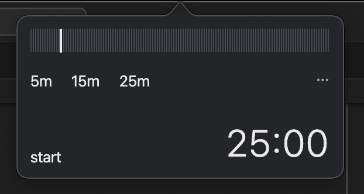
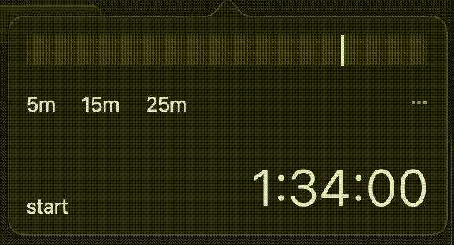

# flutter_timer

A pomodoro timer app for desktop that sits on you menu bar.
Select your desired duration and when the timer end it will send you a notification and optionally play an audio to notify you to take a break.

## Screenshots

The colors seem different from the image due to conversion of MOV to GIF.

